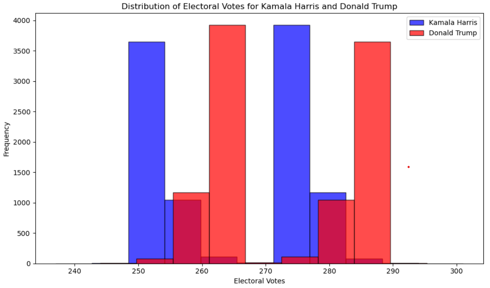
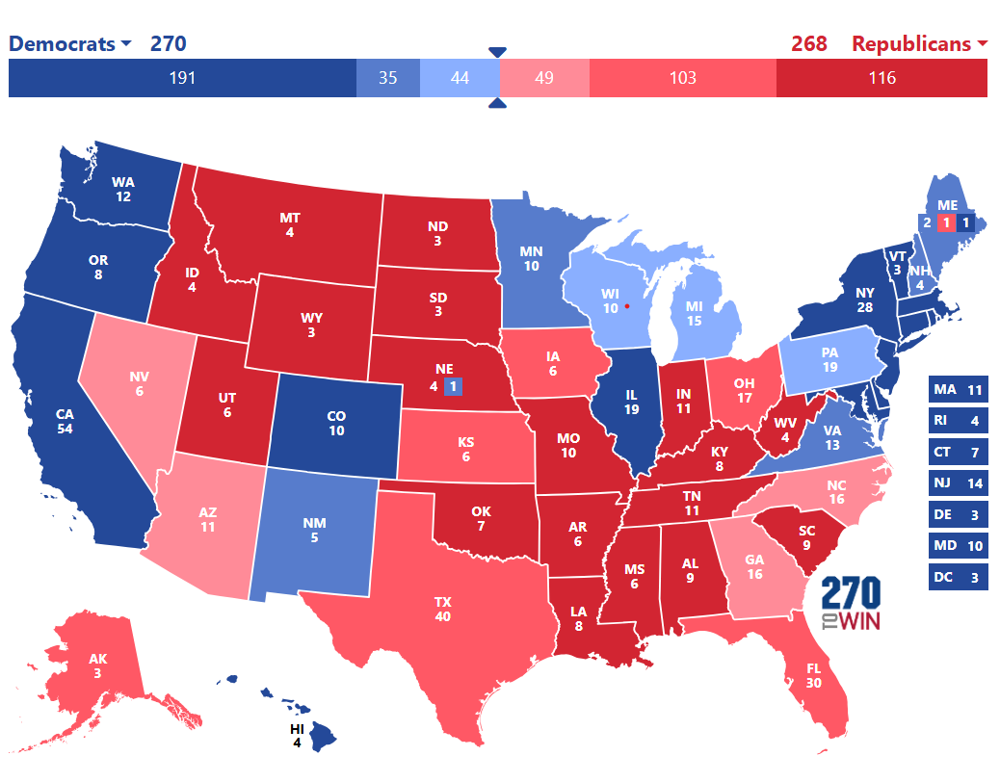

# Election Simulations

This repository contains tools and models for simulating elections, with a focus on simulating U.S. Presidential races. It includes a bootstrap-based simulation of election results, using polling data as input to model the outcomes of a given election based on various voting systems and statistical methods.

## Features

- **Polling Data Simulation**: Simulates election outcomes based on polling data, adjusting for variability in pollster reliability and state-level voting patterns.
- **Parallel Processing**: Utilizes multi-threading to run simulations in parallel for faster processing and result aggregation.
- **Data Aggregation**: Aggregates polling data at the state level, calculating average percentages and electoral vote outcomes for each candidate.
- **Scenario Testing**: Tests different simulation configurations, such as varying the number of iterations or pollster reliability weights.

## Prereqs / Data Origins

1. **Polling Data**:  
   The dataset consists of polling data scraped from the [NYTimes election website](https://www.nytimes.com/). The dataset includes 1550 polls from various sources, covering different states and timeframes in the lead-up to the election.

2. **Data Cleaning and Preprocessing**:  
   The polling data has been cleaned to remove inconsistencies, missing values, and outliers. Only relevant columns (e.g., `geo` for state, `kamala_pct` for Kamala Harris's percentage, `trump_pct` for Donald Trump's percentage) were retained for simulation.

3. **Pollster Ratings**:  
   Each pollster was rated and weighted based on its historical accuracy and reliability. The weights assigned to each pollster influence the simulation, ensuring that more reliable pollsters have a greater effect on the final result. This allows for more realistic simulations where well-regarded pollsters have a larger impact on the predicted outcome. 
   The basic rule I stuck with was to have a maximum "weight" of 3.0 for the top polls (as rated by 538), and 2.0 for all polls that are not in the top 30 of rated polls. 

4. **Geographic Scope**:  
   The simulation covers a set of U.S. states, with each state's data aggregated separately. The states included in the simulation are those that were actively polled during the election cycle. Some states that had little to no polling data were not included. 

## Simulation Step By Step

For each iteration of the simulation, the following steps are performed:

1. **Data Sampling**:
   - **State-level sampling**: For each state that was polled, a random sample of one poll is selected. This ensures that the simulation captures a diverse set of polling data across different sources.
   - **Remaining sample**: After sampling one poll per state, the remaining polls are sampled with replacement from the entire dataset. This creates a bootstrap sample, allowing the simulation to reflect the inherent variability and uncertainty in the polling data.

2. **Gaussian Error Addition**:  
   To simulate the natural variability and uncertainty inherent in polling, a **Gaussian error** (normal distribution) is added to the polling percentages. 

   The error has a mean of 0, for I do not believe that there is significant systematic error in the 2024 election polling cycke, unlike previous election cycles which I have dynamically adjusted the 'bias' (you can see this approach in archive.py, or by visiting my older simulation repository) 

   This error is applied to each poll’s percentage to introduce randomness in the simulations, mimicking real-world polling inaccuracies and fluctuations. The size of the error is controlled by a pre-defined standard deviation, which can be adjusted depending on the desired level of uncertainty in the simulation.

3. **Aggregation of Polling Data**:  
   The sampled polls are aggregated by state. For each state, the simulation calculates the average percentage of support for each candidate (Kamala Harris and Donald Trump), along with their respective electoral votes. This aggregation step is performed by the `aggregate_polls` function, which processes the bootstrap sample to compute the aggregated state-level results.

4. **Election Outcome**:  
   After aggregating the polling data, the simulation determines the winner of the election using the `determine_winner` function. The function compares the total number of electoral votes for each candidate and returns the winner, as well as the breakdown of electoral votes.

5. **Recording Results**:  
   For each iteration, the following results are recorded:
   - The winner of the simulation (either "Kamala Harris" or "Donald Trump").
   - The total number of electoral votes for each candidate in that iteration.
   - The percentage of support for each candidate across all states.

6. **Repetition**:  
   The simulation is repeated for a specified number of iterations (`n_iterations`), typically 1000 or more. This allows the simulation to capture the full range of possible election outcomes and compute average results across multiple runs.

7. **Parallel Execution**:  
   To speed up the simulation, multiple iterations are run in parallel using Python’s `ThreadPoolExecutor`. This allows the simulation to scale efficiently, making it possible to run thousands of iterations in a reasonable amount of time.
   In theory 'ProcessPoolExecutor' makes more sense here, but 

8. **Result Aggregation**:  
   After all iterations are complete, the results are aggregated:
   - The total number of wins for each candidate (Kamala Harris and Donald Trump).
   - The average electoral votes for each candidate.
   - The average percentage of support for each candidate in each state.
   - The overall electoral outcome (who wins the most electoral votes across all iterations).

9. **Unscaled Polling Bias**:  
    At the end of the simulations, I unscale all the polling results by the average 'bias score' for each pollster, so that we get the results as actual percentage estiamtes of votes. 

## Summary of Results

After 10,000 iterations of the election simulation, the results are as follows:

- **Kamala Harris wins** the election in **5,177 out of 10,000** iterations.
- **Donald Trump wins** the election in **4,823 out of 10,000** iterations.

### Electoral Votes Distribution

- **Kamala Harris** has an average of **264.93** electoral votes, while **Donald Trump** has an average of **273.07** electoral votes.
  
    
  *(Bar chart showing the distribution of electoral votes for Kamala Harris and Donald Trump with frequencies)*

### Averaged State-by-State Results (Kamala vs. Trump)

- **Michigan**: Kamala wins **48.85%** vs. Trump **47.60%**
- **Pennsylvania**: Kamala wins **48.33%** vs. Trump **48.31%**
- **Florida**: Trump wins **49.49%** vs. Kamala **44.21%**
- **Georgia**: Trump wins **49.13%** vs. Kamala **47.35%**
- **North Carolina**: Trump wins **49.32%** vs. Kamala **48.19%**
- **Wisconsin**: Kamala wins **49.67%** vs. Trump **48.53%**
- **Arizona**: Trump wins **49.38%** vs. Kamala **47.38%**
- **Nevada**: Trump wins **48.75%** vs. Kamala **48.25%**
- **Ohio**: Trump wins **51.86%** vs. Kamala **44.20%**
- **California**: Kamala wins **56.40%** vs. Trump **34.06%**
- **Texas**: Trump wins **50.48%** vs. Kamala **44.38%**
- **New York**: Kamala wins **59.49%** vs. Trump **42.36%**
- **Illinois**: Kamala wins **58.34%** vs. Trump **41.67%**
- **Massachusetts**: Kamala wins **62.85%** vs. Trump **34.12%**
- **Utah**: Trump wins **57.66%** vs. Kamala **34.25%**
- **Wyoming**: Trump wins **65.93%** vs. Kamala **27.51%**
- **West Virginia**: Trump wins **60.99%** vs. Kamala **34.00%**
- **Vermont**: Kamala wins **70.00%** vs. Trump **29.00%**
- **Iowa**: Trump wins **49.37%** vs. Kamala **45.53%**
- **Minnesota**: Kamala wins **50.03%** vs. Trump **43.80%**
- **Nevada**: Trump wins **48.75%** vs. Kamala **48.25%**
- **Maryland**: Kamala wins **62.92%** vs. Trump **34.12%**
- **Colorado**: Kamala wins **54.76%** vs. Trump **41.47%**
- **Virginia**: Kamala wins **50.14%** vs. Trump **44.25%**
- **Oregon**: Kamala wins **51.00%** vs. Trump **42.50%**
- **New Jersey**: Kamala wins **53.57%** vs. Trump **39.70%**
- **New Mexico**: Kamala wins **50.77%** vs. Trump **43.30%**
- **Connecticut**: Kamala wins **52.99%** vs. Trump **37.00%**
- **Maine (CD1)**: Kamala wins **60.86%** vs. Trump **36.93%**
- **Maine**: Kamala wins **53.72%** vs. Trump **44.87%**
- **Delaware**: Kamala wins **54.93%** vs. Trump **36.54%**
- **Rhode Island**: Kamala wins **55.45%** vs. Trump **38.12%**
- **Illinois**: Kamala wins **58.34%** vs. Trump **41.67%**
- **North Dakota**: Trump wins **54.48%** vs. Kamala **36.01%**
- **Kansas**: Trump wins **48.01%** vs. Kamala **43.00%**
- **South Dakota**: Trump wins **62.63%** vs. Kamala **36.60%**
- **Missouri**: Trump wins **55.78%** vs. Kamala **42.86%**
- **New Hampshire**: Kamala wins **50.52%** vs. Trump **43.56%**
- **Alaska**: Trump wins **52.25%** vs. Kamala **43.97%**
- **Tennessee**: Trump wins **59.93%** vs. Kamala **36.65%**
- **Nebraska (CD1)**: Trump wins **51.01%** vs. Kamala **42.99%**
- **Nebraska (CD2)**: Kamala wins **51.12%** vs. Trump **42.44%**
- **Nebraska (CD3)**: Trump wins **70.00%** vs. Kamala **25.02%**
- **Montana**: Trump wins **57.97%** vs. Kamala **40.64%**
- **South Carolina**: Trump wins **54.25%** vs. Kamala **42.48%**
- **Oregon**: Kamala wins **51.00%** vs. Trump **42.50%**
- **Arizona**: Trump wins **49.38%** vs. Kamala **47.38%**
- **Florida**: Trump wins **49.49%** vs. Kamala **44.21%**
- **Texas**: Trump wins **50.48%** vs. Kamala **44.38%**
- **Indiana**: Trump wins **58.54%** vs. Kamala **42.88%**
- **California**: Kamala wins **56.40%** vs. Trump **34.06%**
- **Michigan**: Kamala wins **48.85%** vs. Trump **47.60%**
- **Pennsylvania**: Kamala wins **48.33%** vs. Trump **48.31%**

### Electoral Map

- Below is the "most likeley" electoral map
    
- Link: https://www.270towin.com/maps/0jdlB
